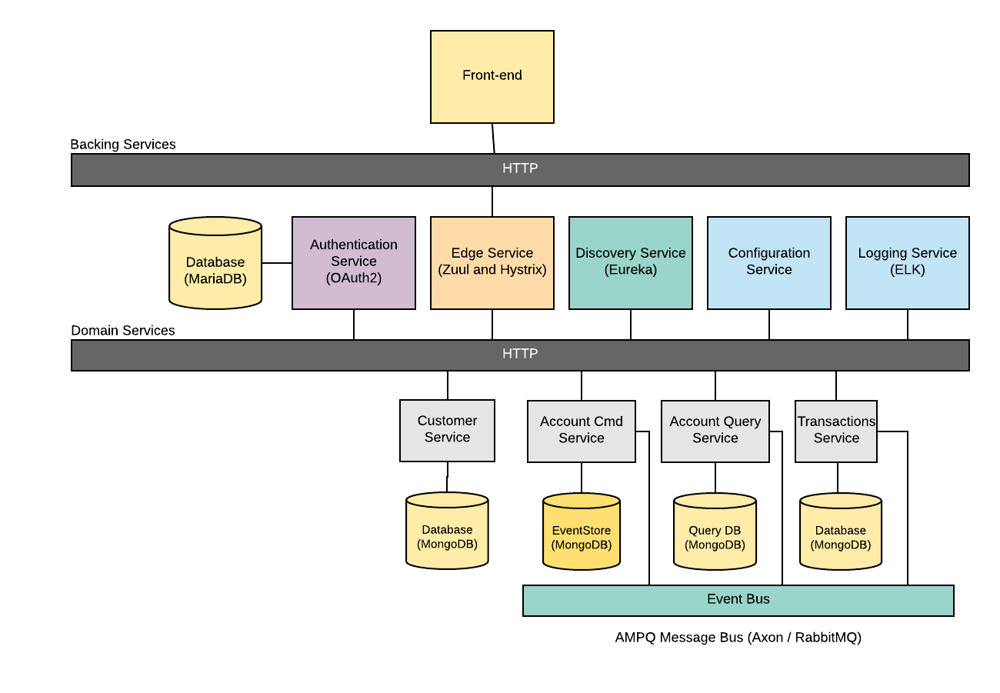
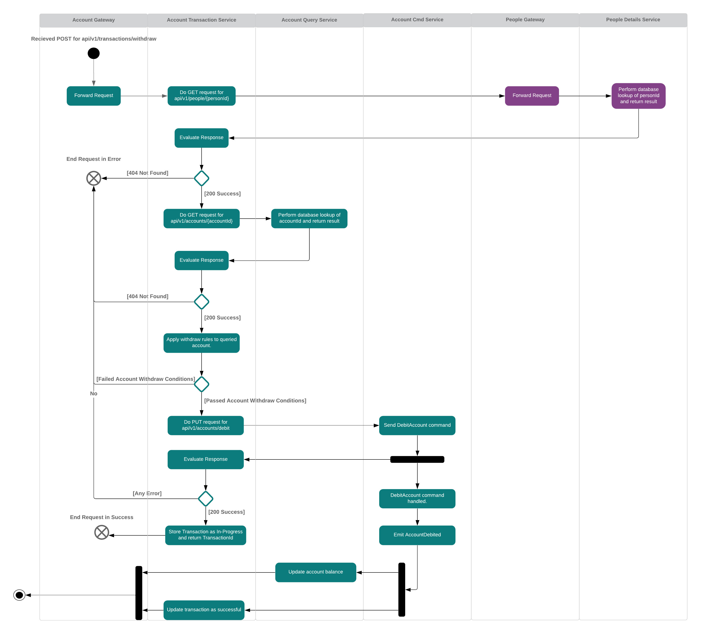
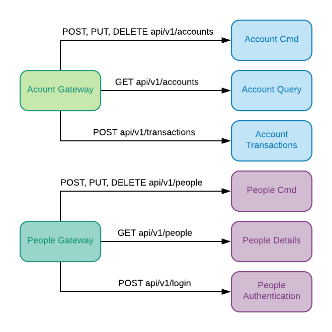
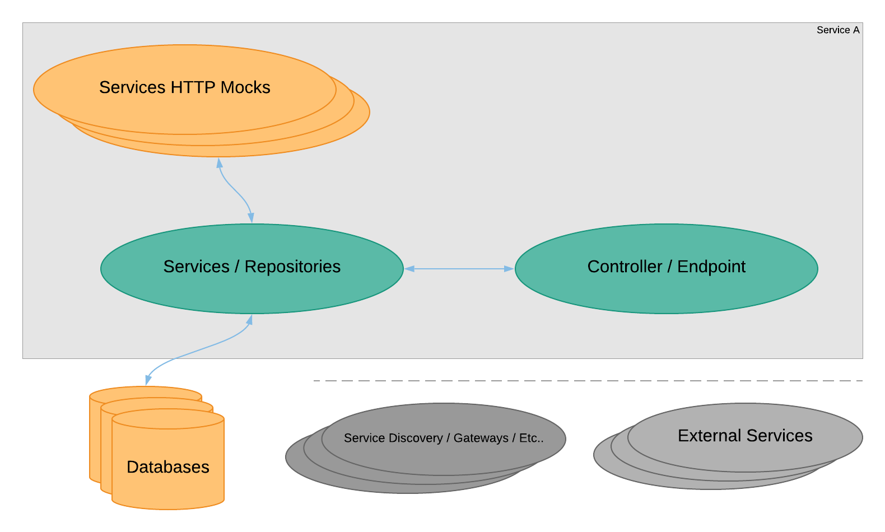
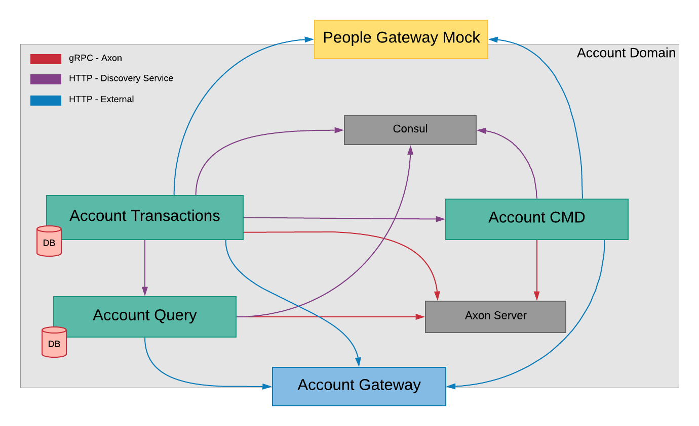
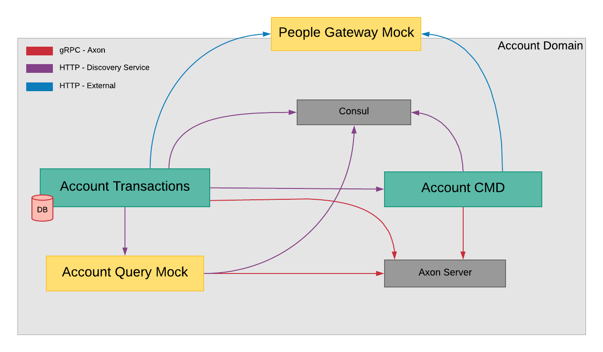

# Banking Microservices Tutorial
[](https://travis-ci.org/AITestingOrg/banking-microservices-tutorial)
[](https://coveralls.io/github/AITestingOrg/banking-microservices-tutorial?branch=master)

The Banking Microservices Tutorial project is a small system used to show how microservices can be implemented and tested with Micronaut, Consul, Tyk, and Axon's Event Sourcing framework. The system can be run in multiple configurations using Docker.


## Architecture

<p style="text-align: center;">The overall Banking Example architecture is broken into two sub-domains, Accounts and People.</p>


<p style="text-align: center;">Example of flow of data after issueing a withdraw command.</p> 


<p style="text-align: center;">Routing configuration of gateways.</p> 

## Configuration
The services can be configured in three ways, a local default configuration under each project resources/application.yml, a development coniguration under
resources/application-dev.yml, and the centralized configuration service. 

## Requirements
See each services readme for detailed requirement information

### Compose
* https://docs.docker.com/compose/install/
* /data/db directory created and accessible to "everyone"

### Java 8
* https://www.oracle.com/technetwork/java/javase/downloads/jdk8-downloads-2133151.html

### IntelliJ IDEA
* The recommended IDE for this project https://www.jetbrains.com/idea/, Community Edition is fine.

### Lombok
* IntelliJ IDEA installation: https://projectlombok.org/setup/intellij

# Running the Project

## Start the Microservices
** Build JARs for each project (You will need to build a JAR anytime changes are made to a project, then rebuild either the container or all containers)
```bash
# Assemble the binaries
./gradlew assemble
# Start the backing services: service discovery, configuration, authentication, edge service
docker-compose up --build
# After verifying everything spun up correctly tear it down.
# Press Control C to shutdown the docker containers
```

## Running with Mocks
To download the Mock images and test running on your machine use the following commands.
```bash
docker-compose -f docker-compose-sub-domain-testing.yml up
# After verifying everything spun up correctly tear it down.
# Press Control C to shutdown the docker containers
```

## Running the PACT Broker
Exercise the PACT Broker service.
```bash
docker-compose -f ./docker/pact-broker/docker-compose.yml up
# After verifying everything spun up correctly tear it down.
# Press Control C to shutdown the docker containers
```

## Rebuild Containers
```bash
docker-compose build
```

# Executing Tests
The following guides are meant to get your environment up and running tests, not necessarily a guide to the most effective way to execute the tests while you are developing them.

## Windows Users
The following examples use shell scripts, simply replace the `.sh` extentions in the examples with 
`.bat` in order to execute them in Command Prompt or PowerShell.

## Running Unit and Integration Tests
The Gradle task 'test' executes the JUnit tests for each project.
```bash
sh ./scripts/run-unit-tests.sh
```

## Running Code Coverage: Unit and Integration Tests
JaCoCo is used for code coverage and can be run after the unit and integration tests for each service have been executed.
You can find a JaCoCo coverage report under the "coverage" in transaction service after running the unit tests.

## Running Service Isolation Tests
The documentation [here](documentation/http_stubbed_isolation_tests.md) provides a guide on creating new isolation tests with HTTP stubs.
### Running Service Isolation Tests with All External Dependencies Mocked
Mocking all external dependencies to the services allows for very rapid execution of tests and 
alleviates the need for configuring or utilizing resources for the external dependencies. 
In memory databases are used in the place of Mongo, though the the same Mongo code dependencies 
are used to connect to these in-memory databases. HTTP mock server stubs are used to provide stubbed responses for external services.

Docker is not required to run these tests as all external dependencies are mocked.
```bash
sh ./scripts/run-isolation-tests-mocked.sh
```

### Running Service Isolation Tests with External Databases, Caches, and Etc...
Here only the calls to other services are mocked, but external dependencies like databases, caches, 
and discovery services are deployed. For this guide we will run the Transaction service isolation tests. 
We use Docker Compose to stand up Mongo. Transactions is the only service demoed here because in an actual product you will most likely have a cloud
deployment infrastructure where you can dynamically configure the HTTP stubs, here we simply use a Docker Compose configuration.

Start the services database using the backing services.
```bash
docker-compose -f docker-compose-mongo-axon.yml up -d
```
Execute the tests in a new terminal once external dependencies have started.
```bash
sh ./scripts/run-isolation-tests.sh
```
Tear down the external dependencies.
```bash
docker-compose -f docker-compose-mongo-axon.yml down
```

If you modify or add an HTTP stub under `./test/resources/wiremock` then you will need to restart the instances so they refresh their mappings. You can read more about the WireMock API [here](http://wiremock.org/docs/stubbing/).

If you update the WireMock request journal validations under `./domain-services/account-transactions/src/tests/resources/wiremock` you will not need to restart the instances, only the tests use these. More documentation on WireMock verification can be found [here](http://wiremock.org/docs/verifying/).

## Running Contract Tests
Ideally, these tests would run in a continuous integration system and not require the Docker Compose steps provided.
Start the domain services with internal mocks so that only the endpoints will be tested.

```bash
docker-compose -f docker-compose-internal-mocked.yml up -d
```
Start the PactBroker service and check `http://localhost:8089` that it is live.
```bash
docker-compose -f ./docker/pact-broker/docker-compose.yml up -d
```
Generate the PACTs and execute them. Note, if you have not completed the PACT tests in all the projects then you will see build failures during the first step here, these can be ignored.
```bash
sh ./scripts/generate-publish-pact-tests.sh
sh ./scripts/run-pact-tests.sh
```
Stop the PactBroker.
```bash
docker-compose -f ./docker/pact-broker/docker-compose.yml down
```
Stop the services with internal mocks.
```bash
docker-compose -f docker-compose-internal-mocked.yml down
```

Note, if you want to examine the individual PACTs, these are generated in `tests/pact-tests` as JSON files.

## Running Service Integration Tests

### Sub-Domain Service Integration Testing
To run the sub-domain service integration tests, all of the dependencies must be available for the given service under test. For this case we will be running integration tests for the Account sub-domain, which means that the gateway for the People domain will be mocked, but all Account related services should be up.


Use docker to stand up the supporting services, databases, and etc...
```bash
docker-compose -f docker-compose-sub-domain-testing.yml up
```
Once the services stabilize, you should see a message like `o.a.a.c.AxonServerConnectionManager - Re-subscribing commands and queries`, at this point you can open a new terminal and run the tests.
```bash
sh ./scripts/run-sub-domain-integration-tests.sh
```
Take down the services in the other terminal window.
```bash
docker-compose -f docker-compose-sub-domain-testing.yml down
```

### Pairwise Service Integration Testing
To run the pairwise service integration tests you will need to have the appropriately configured environment for the particular tests. 
Here, we demo pairwise testing of the Account Transactions and Account Cmd pair, with all other domain services mocked, 
notice that unlike subdomain testing, the domain gateway is not present. This type of testing requires much configuration and thus should 
be used for complicated interactions between two services, not for every service pair.


Use docker to stand up the supporting services, databases, and etc...
```bash
docker-compose -f docker-compose-pair-wise-account-cmd-transaction.yml up
```
Once the services stabilize, you should see a message like `o.a.a.c.AxonServerConnectionManager - Re-subscribing commands and queries`, at this point you can open a new terminal and run the tests.
```bash
sh ./scripts/run-transaction-pairwise-tests-with-cmd.sh
```
Take down the services in the other terminal window.
```bash
docker-compose -f docker-compose-pair-wise-account-cmd-transaction.yml down
```

# API Documentation:
Each service publishes a Swagger YAML configuration, if you are familiar with Swagger UI you can consume the following configurations:
* http://localhost:8082/swagger/Account-Cmd-0.1.yml
* http://localhost:8084/swagger/Account-Query-0.1.yml
* http://localhost:8086/swagger/Account-Transactions-0.1.yml
* http://localhost:8088/swagger/People-Authentication-0.1.yml
* http://localhost:8087/swagger/People-Cmd-0.1.yml
* http://localhost:8085/swagger/People-Query-0.1.yml

It is in the roadmap to expose a Swagger UI endpoint on each service in the future.

# Troubleshooting

## Docker Issues
### Orphaned Docker Containers Are Still Running
If you are seeing issues with port allocations and Docker then try running `docker ps`, 
if you see something running that should not be you can kill it with `docker rmi --force <ID>`. 
A useful Docker command for killing all live containers is `docker kill $(docker ps -q)`

### Containers Keep Restarting or Failing
Try increasing your Docker memory, more than 2 CPUs and 4GB assigned to Docker is preferable for this project.

## Trouble Building
### General Build Issues
Try clearing your global Gradle cache by deleting `~/.gradle` and the local `./.gradle` in the project.

### Duplicate class found
Check that you have the proper version of Java installed `java -version`. If it is not 1.8 then set your JAVA_HOME to 1.8.

### IntelliJ can't find getter methods
You are probably missing the Lombok annotation plugin listed in the project requirement section or haven't turned on the annotation processor setting in IntelliJ.

## Tests Issues
### Test Not Running
Check your imports for JUnit, if you don't see juniper for your `Test` annotation then you are using JUNit 4 and the tests won't run until you fix the imports.

### Mocks are Null
Check that you are using Mockito the JUnit 5 way, with the `MockitoExtension` and `ExtendWith` annotations.

### Services are Rehydrated After Restart and Clearing Mongo
If you have a lot of events then services are going to be rehydrated when you bring everything up. To stop this you can delete the event folders `axonserver-eventstore` and `axonserver-controldb` in the root of the project and then bring the environment up.

### Test Do Not Rerun
Gradle caches outputs from tasks, if it sees an input (in this case the source code) hasn't changed then it won't rerun the tests. You can add `cleanTest` to the scripts in order to force reruns without changes.

### Incorrect Array Size on GET Requests
There may be orphaned results in Mongo, try tearing it down and removing the volumes.

### Parallization
In the root `build.gradle` there is a parallization line for JUnit, but beware, some tests spin up mock servers off their process, this will result in a port conflict if two tests use the same mock server port.
This is only a consideration for service isolation tests and contract test generation.
