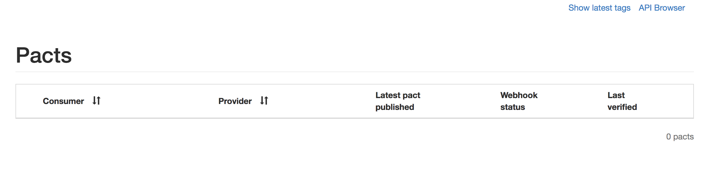
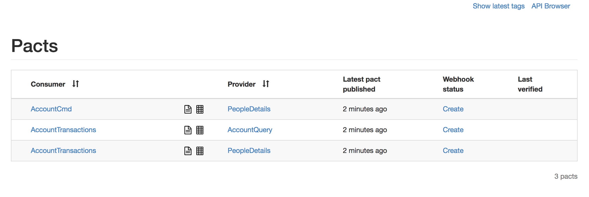
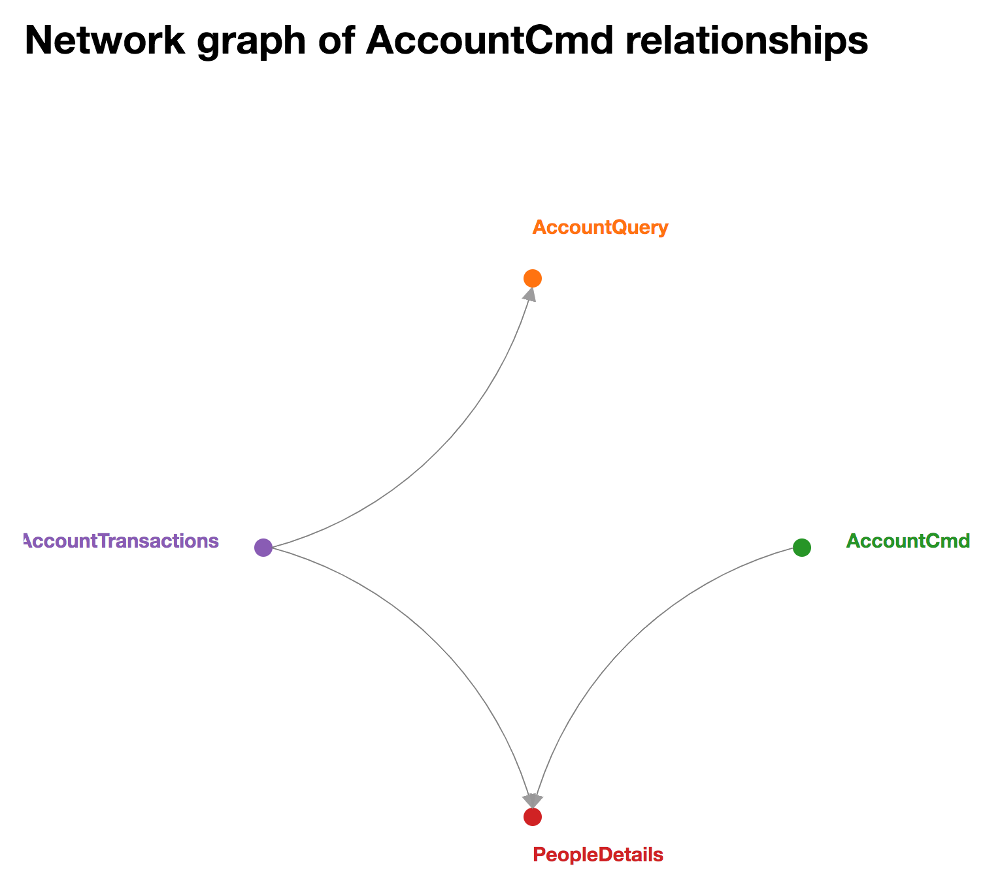

# Contract Testing with PACT
Given all the moving parts and communication between these parts in microservices, contract tests provide valuable, fast feedback.
Ideally, not only are all API methods covered, but also different rejection cases, 
such as bad requests or server errors. For this project, [PACT](https://docs.pact.io/) is used as the contract testing framework. PACT is one of the most popular and mature contract testing frameworks which provides plug-ins and libraries for a range of languages.

## Consumers Create Contracts
Each consumer creates a contract with a provider, in this example, we are going to develop a contract for the Account
Transactions consumer with the Account Command provider for a deposit action. The end result of these contracts are JSON files, like the one below:

### Example of a PACT Contract
```json
{
   "state": "I have a picture that can be downloaded",
   "uponReceiving": "a request to download some-file",
   "withRequest": {
       "method": "GET",
       "path": "/download/somefile"
   },
   "willRespondWith": {
       "status": 200,
       "headers":
       {
           "Content-disposition": "attachment; filename=some-file.jpg"
       }
   }
}
```

To generate a contract, like the one above, we will need to implement a PACT fixture, build the contract, an implement a test which will generate this JSON.

### PACT Fixture
To create a PACT fixture, we use [PACT JVM Consumer for JUnit 5](https://github.com/DiUS/pact-jvm/tree/master/pact-jvm-consumer-junit5).  This
library allows you to extend the test with the `PactConsumerTestExt` extension and annotate the fixture with the provider name and optional port the provider binds to.
```java
@ExtendWith(PactConsumerTestExt.class)
@PactTestFor(providerName = "AccountCmd", port = "8082")
public class ConsumeDepositAccount { 
    ...
}
```

### Deposit PACT
To define the contract, we create a method annotated as a PACT, which provides the consumer and provider names.
The contents of the method consist of aa builder that clearly defines each property of the contract broken into two areas.
The first, the input to send to the provider, and the second is the expected results.
```java
@Pact(provider = "AccountCmd", consumer = "AccountTransactions")
public RequestResponsePact createGetOnePact(PactDslWithProvider builder)
    throws JsonProcessingException {
    return builder
        .given("An account exists.")
        .uponReceiving("Request to credit account.")
        .path("/api/v1/accounts/credit")
        .method("PUT")
        .headers(getHeaders())
        .body(objectMapper.writeValueAsString(new TransactionDto("5c892dbef72465ad7e7dde42", "5c892dbef72465ad7e7dde42", 10.0)))
        .willRespondWith()
        .status(200)
        .body("{\"message\": \"SENT COMMAND\"}")
        .toPact();
}

private Map<String, String> getHeaders() {
    Map<String, String> headers = new HashMap<>();
    headers.put("Content-Type", "application/json");
    return headers;
}
```
Now that we have defined the PACT, we need to generate the JSON for publishing to the broker.

### Generating the PACT and Validating the Contract
To generate the JSON contract, we need to define a test which provides a mock provider that is called and the results are asserted.
To be clear, this does not test the validity of the contract against the actual provider. The PACT library
creates a mock server that is defined by the contract provided, then we may use an HTTP client (here we use [RestAssured](http://rest-assured.io/)) to test that we have correctly created the contract.
Once these tests successfully executes, the PACT library will generate the JSON contract. If this execution is performed by Gradle, then these contracts will be published to the `./test/pact` directory, if you run it through IntelliJ then it will be in the `target` directory of the consumer service.
```java
@Test
void testGetOne(MockServer mockServer) throws IOException {
    given()
        .headers(getHeaders())
        .body(objectMapper.writeValueAsString(new TransactionDto("5c892dbef72465ad7e7dde42", "5c892dbef72465ad7e7dde42", 10.0))).
        when()
        .put(mockServer.getUrl() + "/api/v1/accounts/credit").
        then()
        .statusCode(200);
}
```

### Serialized Contract
Now that you have executed the test against the contract, you should have the following JSON contract.
```json
{
    "provider": {
        "name": "AccountCmd"
    },
    "consumer": {
        "name": "AccountTransactions"
    },
    "interactions": [
        {
            "description": "Request to credit account.",
            "request": {
                "method": "PUT",
                "path": "/api/v1/accounts/credit",
                "headers": {
                    "Content-Type": "application/json"
                },
                "body": {
                    "customerId": "5c892dbef72465ad7e7dde42",
                    "accountId": "5c892dbef72465ad7e7dde42",
                    "amount": 10.0
                }
            },
            "response": {
                "status": 200,
                "body": {
                    "message": "SENT COMMAND"
                }
            },
            "providerStates": [
                {
                    "name": "An account exists."
                }
            ]
        }
    ],
    "metadata": {
        "pactSpecification": {
            "version": "3.0.0"
        },
        "pact-jvm": {
            "version": "3.6.2"
        }
    }
}
```

### Full Code
```java
package com.ultimatesoftware.banking.account.transactions.tests.contracts.consumer;

import au.com.dius.pact.consumer.MockServer;
import au.com.dius.pact.consumer.Pact;
import au.com.dius.pact.consumer.dsl.PactDslWithProvider;
import au.com.dius.pact.consumer.junit5.PactConsumerTestExt;
import au.com.dius.pact.consumer.junit5.PactTestFor;
import au.com.dius.pact.model.RequestResponsePact;
import com.fasterxml.jackson.core.JsonProcessingException;
import com.fasterxml.jackson.databind.ObjectMapper;
import com.ultimatesoftware.banking.account.transactions.models.TransactionDto;
import org.junit.jupiter.api.Test;
import org.junit.jupiter.api.extension.ExtendWith;

import java.io.IOException;
import java.util.HashMap;
import java.util.Map;

import static io.restassured.RestAssured.given;

@ExtendWith(PactConsumerTestExt.class)
@PactTestFor(providerName = "AccountCmd", port = "8082")
public class ConsumeDepositAccount {
    private ObjectMapper objectMapper = new ObjectMapper();

    @Pact(provider = "AccountCmd", consumer = "AccountTransactions")
    public RequestResponsePact createGetOnePact(PactDslWithProvider builder)
        throws JsonProcessingException {
        return builder
            .given("An account exists.")
            .uponReceiving("Request to credit account.")
            .path("/api/v1/accounts/credit")
            .method("PUT")
            .headers(getHeaders())
            .body(objectMapper.writeValueAsString(new TransactionDto("5c892dbef72465ad7e7dde42", "5c892dbef72465ad7e7dde42", 10.0)))
            .willRespondWith()
            .status(200)
            .body("{\"message\": \"SENT COMMAND\"}")
            .toPact();
    }

    @Test
    void testGetOne(MockServer mockServer) throws IOException {
        given()
            .headers(getHeaders())
            .body(objectMapper.writeValueAsString(new TransactionDto("5c892dbef72465ad7e7dde42", "5c892dbef72465ad7e7dde42", 10.0))).
            when()
            .put(mockServer.getUrl() + "/api/v1/accounts/credit").
            then()
            .statusCode(200);
    }

    private Map<String, String> getHeaders() {
        Map<String, String> headers = new HashMap<>();
        headers.put("Content-Type", "application/json");
        return headers;
    }
}

```

## Contracts are Published to the Broker
The PACT Broker provides a repository for contracts and test results. Here, 
we will demo the contract repository functionality using the [PACT JVM Provider](https://github.com/DiUS/pact-jvm/tree/master/pact-jvm-provider-gradle) Gradle plug-in. 

### Publish PACT Contracts
Since we have already generated the JSON contracts, all we need to do now is submit them to the PACT Broker. We can do this using a simple HTTP POST. However, we will use the plug-in's `pactPublish` task which has already been configured for use with the provider PACT Broker. Note, you will need to use Gradle to generate the PACTs since the publish step is configured for the `./tests/pact` directory, use `./gradlew test --tests "*.contracts.consumer.*"`.
```bash
# Start the PACT Broker
docker-compose -f ./docker/pact-broker/docker-compose.yml up
```

Once the PACT broker is live, you should be able to visit it at `http://localhost:8089`.

You should see the home page with no PACTs present.

To publish the PACTs use the following Gradle command either from IntelliJ or the terminal.
```bash
./gradlew pactPublish
```
This should output 201 Created responses from the broker.

Now the broker should have PACT contracts.

If you click on either a provider or consumer, you should also see a nice dependency topography map.


## Contracts are Executed Against Endpoints with Mocked Logic
Now, we need to execute the published contracts against the real providers, 
in order to run these tests efficiently, the providers are heavily stubbed or mocked. 
This works since we are not looking for state and logic around the state as much as we are looking to validate or map input to output status codes and structure; in other words, the contract.

### Defined Providers
We have already defined the providers using the Gradle plugin within `./build.gradle` under the task Pact, which looks like the following:
```groovy
pact {
  serviceProviders {
      AccountCmd {
          protocol = 'http'
          host = 'localhost'
          port = 8082
          path = '/'
          if ('pactVerify' in gradle.startParameter.taskNames) {
              hasPactsFromPactBroker('http://localhost:8089')
          }
      }
    }
  }
```
Here the path to the PACT broker is provided as well as the location and port of the provider AccountCmd.

### Running The Contract Tests
First, we need the providers APIs to be up, the Docker Compose configuration below will provide heavily stubbed/mocked APIs, allowing us to run the contract tests with minimal infrastructure.
```bash
docker-compose -f docker-compose-internal-mocked.yml up -d
```

Now, we can finally run the tests. The PACT Gradle plug-in also provides a method for executing these contracts through a task called `pactVerify`.
This task uses the configuration above to determine what providers are present, where to submit the contract tests to, and where to find the PACT contracts.
```bash
./gradlew pactVerify
```
This command should complete successfully, outputting results for each test in a Given / When / Then syntax.

## Summary
In this guide, we learned how to build PACT contracts, publish them to the PACT Broker, and execute consumer contract tests against the actual providers, where the provider is the sum of the consumer contracts against it.